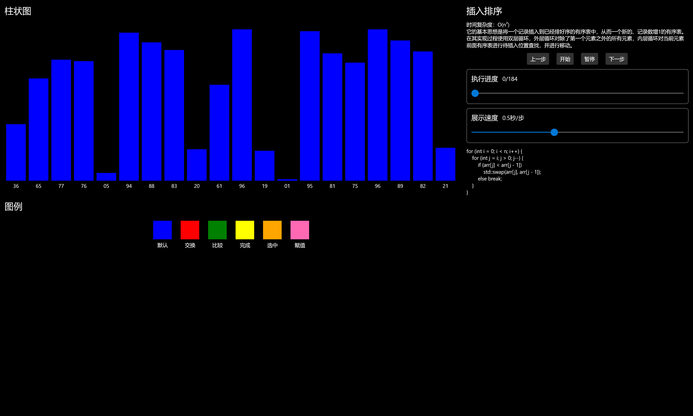

# 算法可视化

## 基本介绍

软件旨在将抽象的算法通过易于理解的可视化呈现在学习者的眼前，帮助学习者更容易地学习算法。

## 应用发布

**此应用已经上架到 Microsoft Store，使用者可以打开下方的链接并在任意一台Windows10设备上免费安装。**

[算法可视化 - Microsoft Store zh-CN](https://www.microsoft.com/zh-cn/p/算法可视化/9mvgxjkpmcvm?rtc=1&activetab=pivot:overviewtab)

## 可演示的算法

### 排序算法

计算机软件常用算法

#### 4种初等排序

##### 冒泡排序

##### 选择排序

##### 插入排序

##### 希尔排序

#### 3种高等比较排序

##### 归并排序

##### 快速排序

##### 堆排序

#### 3种高等非比较排序

##### 计数排序

##### 桶排序

##### 基数排序

### 传染病模型

生物学应用与数学建模大赛常用算法

#### SI 易感-感染

#### SIS 易感-感染-易感

#### SIR 易感-感染-康复

#### SEIR 易感-潜伏-感染-康复

#### SEIAR 易感-潜伏-感染-无症状-康复

## 软件迭代

未来将加入更多的算法（例如：查找算法、图遍历算法等）来帮助学习者易于理解地学习更多算法。

